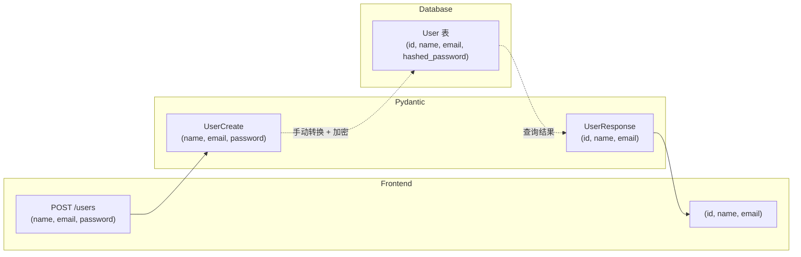
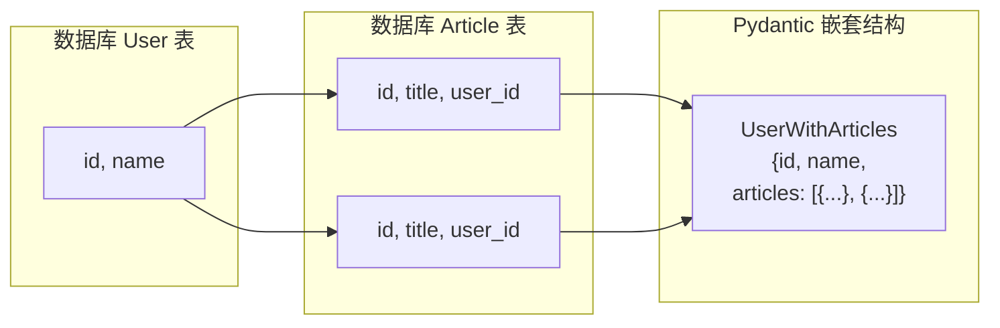

# Pydantic 学习笔记

---

## 第一课：Pydantic 是什么？为什么 FastAPI + SQLAlchemy 离不开它？

### 核心概念

Pydantic 是一个**数据验证与解析库**。它的核心就是 `BaseModel`：

```python
from pydantic import BaseModel

class UserCreate(BaseModel):
    name: str
    age: int
    email: str
```

就这么简单——你定义了一个"数据形状"，Python 的类型注解就是规则。

### 它做了什么？

```python
user = UserCreate(name="小明", age="18")  # age 传了字符串 "18"
print(user.age)   # 输出 18（int！自动类型转换）
print(user.model_dump())  # {'name': '小明', 'age': 18, 'email': ???}
```

等等，没传 `email` 会怎样？——**报错**，因为 `email: str` 默认是必填字段。

### 三个核心能力

| 能力 | 说明 | 违反时 |
| -------- | -------------------------------------------------- | ------------------- |
| **类型校验** | age 必须是 int（或能转成 int） | 抛 `ValidationError` |
| **类型转换** | "18" 自动转成 18 | — |
| **序列化** | `.model_dump()` 转 dict，`.model_dump_json()` 转 JSON | — |

> **名词解释：为什么叫 dump？**
>
> "dump" 在编程中通常指 **"导出/转储"** —— 把内存里的结构化数据"倒出来"成通用格式。
>
> - `model_dump()` → 倒成 Python dict（方便你取字段、传给其他函数）
> - `model_dump_json()` → 倒成 JSON 字符串（方便返回给前端或写入文件）
>
> 中文可以理解为 **"序列化输出"**，但社区习惯直接叫 dump。你记住是 **"把 Pydantic 模型转成通用格式"** 就行。


### 和 FastAPI 有什么关系？

FastAPI 的 **request/response 全靠 Pydantic 模型**：

```python
from fastapi import FastAPI
from pydantic import BaseModel

app = FastAPI()

class UserCreate(BaseModel):
    name: str
    age: int

@app.post("/users")
def create_user(user: UserCreate):  # FastAPI 自动验证请求体
    return {"name": user.name, "age": user.age}
```

当你 POST `{"name": "小明", "age": "18"}` 到 `/users`：

1. FastAPI 用 `UserCreate` 自动解析请求体
2. 校验通过 → 得到 `UserCreate` 实例
3. 校验失败 → 自动返回 422 + 错误详情（**零代码实现**）

### 和 SQLAlchemy 有什么关系？

我们通过一个**完整的注册流程**来看：

#### 场景：用户注册
```
前端 POST /users
  JSON: {"name": "小明", "email": "x@x.com", "password": "123456"}
```

#### 第一步：Pydantic 在前门接客

```python
from pydantic import BaseModel

# 这个模型只管"API 请求长什么样"
class UserCreate(BaseModel):
    name: str
    email: str
    password: str   # 用户提交了密码
```

当用户 POST 数据过来，FastAPI 用 `UserCreate` 校验 → 通过 → 你得到一个 `UserCreate` 实例。

**但是！Pydantic 不会存数据库。** 它只是帮你把数据"擦干净"交到你手里。

---

#### 第二步：你手动把数据转给 SQLAlchemy

```python
from sqlalchemy.orm import DeclarativeBase, Mapped, mapped_column

class Base(DeclarativeBase):
    pass

# 这个模型只管"数据库表长什么样"
class User(Base):
    __tablename__ = "users"

    id: Mapped[int] = mapped_column(primary_key=True)         # 数据库自增
    name: Mapped[str]                                         # 默认 NOT NULL
    email: Mapped[str] = mapped_column(unique=True)            # 数据库约束
    hashed_password: Mapped[str]                               # 存的是哈希，不是明文！
```

**注意差异：**
- `UserCreate` 里有 `password`（明文），`User` 表里是 `hashed_password`（哈希）
- `User` 表有 `id` 字段，但 `UserCreate` 里没有——id 是数据库自动生成的
- `UserCreate` 没有 `hashed_password`——那是数据库内部字段，用户不该知道

```python
# 在路由里，你手动做"Pydantic → SQLAlchemy"的转换
from hashlib import sha256

@app.post("/users")
def create_user(user_data: UserCreate, db: Session):
    # user_data 是 Pydantic 模型（API 数据）
    # User 是 SQLAlchemy 模型（数据库表）

    db_user = User(
        name=user_data.name,
        email=user_data.email,
        hashed_password=sha256(user_data.password.encode()).hexdigest()  # 加密后存入
    )
    db.add(db_user)
    db.commit()
```

---

#### 第三步：返回给前端时，SQLAlchemy → Pydantic

```python
# 这个模型只管"API 响应长什么样"
class UserResponse(BaseModel):
    id: int
    name: str
    email: str
    # 注意：没有 password，没有 hashed_password！

@app.post("/users")
def create_user(user_data: UserCreate, db: Session):
    # ... 存库 ...
    return UserResponse(
        id=db_user.id,         # 从数据库取出来的自增 id
        name=db_user.name,
        email=db_user.email
    )
```

---

#### 整条数据流长这样：



#### 为什么必须拆成三层？

| 层 | 职责 | 和别的层什么关系 |
|--------|------|------------------|
| `UserCreate` | 定义"用户注册时要提交什么" | 有 password，没有 id |
| `User` (SQLAlchemy) | 定义"数据库里存什么" | 有 id，存的是 hashed_password |
| `UserResponse` | 定义"返回给前端什么" | 有 id，没有 password |

**这就是核心套路：** 数据在**Pydantic → SQLAlchemy → Pydantic**之间来回手动转换，每一层的"形状"都不一样，你必须显式地写转换代码。

> **一句话总结：** Pydantic 管"API 长什么样"，SQLAlchemy 管"数据库长什么样"，你在中间写代码把数据从一种形状"掰"成另一种形状。

---

---

## 第二课：字段类型、默认值与可选字段

### 必填 vs 可选

Pydantic 的默认规则：**写了类型就是必填**。

```python
from pydantic import BaseModel

class UserCreate(BaseModel):
    name: str           # 必填
    age: int            # 必填
    email: str | None = None   # 可选（给默认值 None）
    phone: str = ""     # 可选（给默认值 空字符串）
    score: float = 0.0  # 可选（给默认值 0.0）
```

> **记忆口诀：** 没给默认值 = 必填；给了默认值 = 可选。

细心的你会问：那 `email: str | None` 和 `email: str = None` 有什么区别？

```python
class UserCreate(BaseModel):
    email: str | None = None   # ✅ 既可以为 None，也给了默认值
    phone: str | None          # ❌ 运行时没区别，但类型检查器会警告没默认值
    tag: str | None = "新用户"  # ✅ 可以为 None，默认是 "新用户"
```

> `str | None` 是 Python 3.10+ 语法，等价于 `Optional[str]`。

### 在 FastAPI 中的实际体现

```python
from fastapi import FastAPI
from pydantic import BaseModel

app = FastAPI()

class UserCreate(BaseModel):
    name: str
    email: str = ""
    age: int = 18

@app.post("/users")
def create_user(user: UserCreate):
    return user.model_dump()
```

请求测试：

| 请求体 | 结果 |
|--------|------|
| `{"name": "小明"}` | ✅ 成功 → `{"name": "小明", "email": "", "age": 18}` |
| `{"name": "小明", "age": "20"}` | ✅ age 自动转 int |
| `{}` | ❌ 422 — name 是必填的 |
| `{"name": "小明", "age": "abc"}` | ❌ 422 — "abc" 不能转 int |

> FastAPI 收到非法数据时**自动返回 422 + 错误详情**，不需要你写一行校验代码。

### 常见类型速览

```python
from pydantic import BaseModel
from datetime import datetime
from decimal import Decimal
from uuid import UUID, uuid4

class Product(BaseModel):
    id: UUID = uuid4()           # UUID，自动生成
    name: str
    price: Decimal               # 适合金额，不会丢失精度
    created_at: datetime = None  # datetime 类型
    tags: list[str] = []         # 字符串列表
    specs: dict[str, float] = {} # 字典
```

> `Decimal` 比 `float` 更适合钱——`float` 有精度问题（0.1 + 0.2 ≠ 0.3）。

### 和 SQLAlchemy Column 的对比

```python
# Pydantic（API 层）
class UserCreate(BaseModel):
    name: str
    age: int = 18

# SQLAlchemy 2.0（数据库层）
class User(Base):
    __tablename__ = "users"
    id: Mapped[int] = mapped_column(primary_key=True)
    name: Mapped[str]
    age: Mapped[int | None]          # 对应 nullable=True
    score: Mapped[float] = mapped_column(default=0.0)
```

| 对比项 | Pydantic | SQLAlchemy 2.0 |
|--------|----------|----------------|
| `name: str` | 默认必填 | `Mapped[str]` = NOT NULL |
| `age: int = 18` | 默认值 18 | `Mapped[int] = mapped_column(default=18)` |
| 可为空 | `str \| None = None` | `Mapped[str \| None]` |
| 额外约束 | 不支持 | `mapped_column(unique=True)` 等 |

**直觉：** Pydantic 负责 API 数据的"形状"，SQLAlchemy 负责数据库表的"形状"。两者看起来像，但**完全不通用**——你不能直接把 Pydantic 模型存进数据库。

---

**第二课结束。** 喊 **继续** 我开始第三课：Field 函数与高级校验。

---

## 第三课：Field 函数 — 给字段加"规矩"

### 为什么需要 Field？

光靠 `name: str` 只能限制"必须是字符串"，但实际需求往往更细：

- 用户名至少 2 个字符
- 年龄在 1~120 之间
- 密码最少 6 位
- 邮箱要符合格式

这些用 `Field()` 来实现：

```python
from pydantic import BaseModel, Field

class UserCreate(BaseModel):
    name: str = Field(min_length=2, max_length=20)
    age: int = Field(ge=1, le=120)        # greater or equal / less or equal
    password: str = Field(min_length=6)
    score: float = Field(ge=0.0, le=100.0)
```

> `Field()` 是函数调用，返回特殊对象，**不是类型注解**——它和默认值写在一起。

### 常见 Field 参数速查

| 参数 | 作用 | 适用类型 | 示例 |
|------|------|----------|------|
| `min_length` / `max_length` | 字符串长度限制 | str | `Field(min_length=2)` |
| `ge` / `le` | 大小限制 (>= / <=) | int, float | `Field(ge=0, le=100)` |
| `gt` / `lt` | 大小限制 (> / <) | int, float | `Field(gt=0)` |
| `pattern` | 正则匹配 | str | `Field(pattern=r"^\d{11}$")` |
| `default` | 默认值 | 任意 | `Field(default="未知")` |
| `default_factory` | 动态默认值 | 可调用 | `Field(default_factory=uuid4)` |
| `alias` | JSON 中的别名 | 任意 | `Field(alias="user_name")` |
| `description` | 字段说明 | 任意 | `Field(description="用户昵称")` |
| `examples` | 示例值 | 任意 | `Field(examples=["小明"])` |

### 在 FastAPI 中的效果

```python
from fastapi import FastAPI
from pydantic import BaseModel, Field

app = FastAPI()

class UserCreate(BaseModel):
    name: str = Field(min_length=2, max_length=20)
    age: int = Field(ge=1, le=120)
    phone: str = Field(pattern=r"^1\d{10}$")  # 中国大陆手机号

@app.post("/users")
def create_user(user: UserCreate):
    return user.model_dump()
```

请求测试：

| 请求体 | 响应 |
|--------|------|
| `{"name": "X", "age": 18, "phone": "13800138000"}` | ❌ 422 — name 太短（min_length=2） |
| `{"name": "小明", "age": 200, "phone": "13800138000"}` | ❌ 422 — age 超了（le=120） |
| `{"name": "小明", "age": 18, "phone": "1234"}` | ❌ 422 — 不匹配正则 `^1\d{10}$` |
| `{"name": "小明", "age": 18, "phone": "13800138000"}` | ✅ 成功 |

所有这些校验规则还会**自动生成 OpenAPI 文档**，Swagger UI 上直接能看到字段约束。

### 和 SQLAlchemy Column 的对比（续）

```python
# Pydantic — API 层校验
class UserCreate(BaseModel):
    name: str = Field(min_length=2, max_length=50)
    age: int = Field(ge=0, le=150)

# SQLAlchemy 2.0 — 数据库层约束
class User(Base):
    __tablename__ = "users"
    id: Mapped[int] = mapped_column(primary_key=True)
    name: Mapped[str] = mapped_column(String(50))   # 数据库也限制长度
    age: Mapped[int]
```

| 作用域            | 谁管           | 什么时候生效                |
| -------------- | ------------ | --------------------- |
| `min_length=2` | **Pydantic** | API 请求到达时，**写入数据库之前** |
| `String(50)`   | **数据库**      | 写入数据库时，SQL 层面约束       |
| `unique=True`  | **数据库**      | 只有数据库能保证唯一            |

> **关键理解：** Pydantic 的校验在**应用层**（快，用户请求一到就拒绝），数据库约束在**持久层**（保底，防止程序 bug 或并发问题）。两者是**互补**关系，不是二选一。

---

**第三课结束。** 喊 **继续** 我开始第四课：`model_config` 与模型配置（orm_mode、extra 等）。

---

## 第四课：model_config — 配置模型行为

### 从痛点说起

回到第二课的问题：从数据库查出来数据后，你得手动写：

```python
UserResponse(
    id=db_user.id,
    name=db_user.name,
    email=db_user.email
)
```

那如果 User 表有 20 个字段呢？也要一个个手写？

**答案是：用 `from_attributes=True` 自动映射。**

### from_attributes — 自动从 ORM 对象创建

```python
from pydantic import BaseModel
from sqlalchemy.orm import Mapped, mapped_column

# ---------- Pydantic ----------
class UserResponse(BaseModel):
    model_config = {"from_attributes": True}   # ← 关键配置！

    id: int
    name: str
    email: str

# ---------- SQLAlchemy ----------
class User(Base):
    __tablename__ = "users"
    id: Mapped[int] = mapped_column(primary_key=True)
    name: Mapped[str]
    email: Mapped[str]
    hashed_password: Mapped[str]   # 注意：UserResponse 里没有这个字段
```

然后就可以：

```python
user = db.query(User).first()
resp = UserResponse.model_validate(user)  # 自动读 ORM 对象的属性！
# 等价于手动写：
# resp = UserResponse(id=user.id, name=user.name, email=user.email)
```

**关键规则：**
1. Pydantic 会去读 SQLAlchemy 对象的**同名属性**（user.id, user.name...）
2. SQLAlchemy 有但 Pydantic 没有的字段 → **自动忽略**（如 hashed_password）
3. Pydantic 有但 SQLAlchemy 没有的字段 → **报错**

> `model_validate()` 是 Pydantic v2 的方法，替代 v1 的 `from_orm()`。

### 完整示例：查询接口

```python
from fastapi import FastAPI, Depends
from pydantic import BaseModel

app = FastAPI()

class UserResponse(BaseModel):
    model_config = {"from_attributes": True}
    id: int
    name: str
    email: str

@app.get("/users/{user_id}")
def get_user(user_id: int, db: Session = Depends(get_db)):
    user = db.query(User).filter(User.id == user_id).first()
    if not user:
        return {"error": "not found"}, 404
    return UserResponse.model_validate(user)
    # ↑ 三行代码搞定"查数据库 → 转 Pydantic → 返回 JSON"
```

### 其他常用配置

```python
class UserCreate(BaseModel):
    model_config = {
        "from_attributes": True,
        "extra": "forbid",              # 拒绝未定义的字段（默认 "ignore"）
        "str_strip_whitespace": True,   # 自动去掉字符串首尾空格
        "str_min_length": 1,            # 全局最短字符串长度
        "populate_by_name": True,       # 允许用字段名赋值（配合 alias 时有用）
    }
    name: str
    age: int
```

| 配置项                    | 作用               | 推荐值              |
| ---------------------- | ---------------- | ---------------- |
| `from_attributes`      | 允许从 ORM 对象创建模型   | `True`（返回响应时用）   |
| `extra: "forbid"`      | 拒绝请求中未定义的字段      | `"forbid"`（请求体用） |
| `str_strip_whitespace` | 自动 trim 字符串      | `True`           |
| `populate_by_name`     | 允许用 Python 字段名赋值 | 看场景              |

| `populate_by_name`     | 允许用 Python 字段名赋值 | 看场景              |

#### populate_by_name 详解

先看一个实际场景：前端传的是 `user_name`，但你代码里想用 `username`（没有下划线）：

```python
class UserCreate(BaseModel):
    username: str = Field(alias="user_name")   # 前端传 user_name，代码里用 username

user = UserCreate(**{"user_name": "小明"})     # ✅ 必须用别名
user = UserCreate(username="小明")              # ❌ 报错！Field 有 alias 就不能用原名了
```

这就很烦——尤其是写测试的时候。`populate_by_name=True` 解决这个问题：

```python
class UserCreate(BaseModel):
    model_config = {"populate_by_name": True}
    username: str = Field(alias="user_name")

# 两种方式都可以：
user = UserCreate(**{"user_name": "小明"})     # ✅ 用别名（前端来的数据）
user = UserCreate(username="小明")              # ✅ 用原名（测试代码里用）
```

在 FastAPI 中 `alias` 最常见的用法：**前端字段名和 Python 变量名不一致时**，用 alias 桥接，不需要改 JSON 字段名。

> 大部分时候你不需要这个配置——FastAPI 路由参数自动处理了 alias。只有在测试或手动创建模型时才需要。所以推荐只在请求体模型关掉它，响应体模型无所谓。

### 最佳实践：拆成三个 Config

```python
# 请求体 — 严格校验
class UserCreate(BaseModel):
    model_config = {"extra": "forbid", "str_strip_whitespace": True}
    name: str = Field(min_length=2, max_length=50)
    email: str
    password: str = Field(min_length=6)

# 响应体 — 允许 ORM 映射
class UserResponse(BaseModel):
    model_config = {"from_attributes": True}
    id: int
    name: str
    email: str

# 数据库更新 — 部分字段可选
class UserUpdate(BaseModel):
    model_config = {"extra": "forbid"}
    name: str | None = None
    email: str | None = None
```

> 注意：请求体不要开 `from_attributes`，因为没必要从 ORM 创建请求数据；响应体才需要。

---

**第四课结束。** 喊 **继续** 我开始第五课：类型嵌套与关系模型（Pydantic 处理 SQLAlchemy 关联关系）。

---

## 第五课：类型嵌套与关联关系

### 场景：用户有多个文章

前面我们只有一个 User 表。现在加一个 Article 表，用户和文章是一对多关系。

```python
# SQLAlchemy 模型
class User(Base):
    __tablename__ = "users"
    id: Mapped[int] = mapped_column(primary_key=True)
    name: Mapped[str]
    articles: Mapped[list["Article"]] = relationship(back_populates="author")

class Article(Base):
    __tablename__ = "articles"
    id: Mapped[int] = mapped_column(primary_key=True)
    title: Mapped[str]
    content: Mapped[str]
    user_id: Mapped[int] = mapped_column(ForeignKey("users.id"))
    author: Mapped["User"] = relationship(back_populates="articles")
```

### Pydantic 如何表达嵌套？

Pydantic 模型可以**嵌套其他 Pydantic 模型**，和 SQLAlchemy 的 `relationship` 一一对应：

```python
from pydantic import BaseModel
from datetime import datetime

# 文章响应体
class ArticleResponse(BaseModel):
    model_config = {"from_attributes": True}
    id: int
    title: str
    content: str

# 用户响应体（包含文章列表）
class UserWithArticles(BaseModel):
    model_config = {"from_attributes": True}
    id: int
    name: str
    articles: list[ArticleResponse]   # ← 嵌套！
```



### 实际效果

查询一个用户 + 他的文章，Pydantic 自动把 SQLAlchemy 的 `relationship` 也映射进去：

```python
@app.get("/users/{user_id}")
def get_user_with_articles(user_id: int, db: Session = Depends(get_db)):
    user = db.query(User).filter(User.id == user_id).first()
    return UserWithArticles.model_validate(user)
```

返回的 JSON：

```json
{
    "id": 1,
    "name": "小明",
    "articles": [
        {"id": 1, "title": "Pydantic 入门", "content": "..."},
        {"id": 2, "title": "FastAPI 实战", "content": "..."}
    ]
}
```

> **核心机制：** `model_validate()` 遇到 `list[ArticleResponse]` 时，会自动遍历 `user.articles` 这个 `relationship` 列表，对每一项递归调用 `ArticleResponse.model_validate()`。

### 反向嵌套：文章带上作者

```python
class ArticleWithAuthor(BaseModel):
    model_config = {"from_attributes": True}
    id: int
    title: str
    content: str
    author: UserResponse   # ← 反向嵌套

# UserResponse 需要定义在 ArticleWithAuthor 之前
class UserResponse(BaseModel):
    model_config = {"from_attributes": True}
    id: int
    name: str
    email: str
```

返回：

```json
{
    "id": 1,
    "title": "Pydantic 入门",
    "content": "...",
    "author": {"id": 1, "name": "小明", "email": "x@x.com"}
}
```

### ⚠️ 避免循环嵌套

```python
class UserWithArticles(BaseModel):
    articles: list[ArticleWithAuthor]   # ❌ 循环：User → Article → User → ...

class ArticleWithAuthor(BaseModel):
    author: UserWithArticles            # ❌ 死循环！
```

**解决方法：** 把嵌套拆成不同层级的模型，不要互相引用。

```python
# 平级结构，谁也不嵌套谁
class UserResponse(BaseModel):
    id: int
    name: str

class ArticleResponse(BaseModel):
    id: int
    title: str
    user_id: int     # 只存外键，不嵌套 User

# 然后在路由里手动组装
class UserArticlesResponse(BaseModel):
    user: UserResponse
    articles: list[ArticleResponse]
```

### 防止 N+1 查询

Pydantic 嵌套自动映射 SQLAlchemy `relationship` 时，如果不做预加载，会触发 N+1 问题：

```python
user = db.query(User).first()                          # 1 次查询
UserWithArticles.model_validate(user)                   # N 次查询（一次取一个 article）
```

解决方法：用 SQLAlchemy 的 `joinedload` 或 `selectinload` **预加载**：

```python
from sqlalchemy.orm import selectinload

user = db.query(User).options(
    selectinload(User.articles)        # ← 一次查出所有关联文章
).filter(User.id == user_id).first()

UserWithArticles.model_validate(user)  # 不会再触发额外查询
```

> **一句话：** 嵌套越深，数据库查询越要提前规划好。Pydantic 只管映射，不管性能。

---

**第五课结束。** 喊 **继续** 我开始第六课：Validator 验证器与自定义校验逻辑。

---

## 第六课：@field_validator — 当 Field 不够用时

### 什么时候需要 Validator？

`Field(min_length=..., ge=...)` 只能做**独立的、单字段的**规则校验。但实际中常有：

- password 和 confirm_password 必须相等
- 注册时邮箱不能已存在（需要查数据库）
- 手机号和微信号至少要填一个

这些需要**写代码逻辑**的校验，用 `@field_validator`。

### 基本用法

```python
from pydantic import BaseModel, field_validator

class UserCreate(BaseModel):
    name: str
    age: int = Field(ge=0, le=150)
    phone: str = ""

    @field_validator("name")
    @classmethod
    def name_must_be_meaningful(cls, v: str) -> str:
        if v == "admin":
            raise ValueError("不能使用保留用户名")
        return v.strip()   # 返回处理后的值
```

> **注意：** Pydantic v2 必须加 `@classmethod`，方法名随意，第一个参数是 `cls`，第二个参数 `v` 是字段的原始值。

执行流程：

```python
UserCreate(name=" 小明  ", age=18)
# 1. Pydantic 先做类型转换（" 小明 " 是 str，通过）
# 2. 检查 Field 规则（没有 min_length，通过）
# 3. 调用 @field_validator("name") → 去空格 → "小明"
# 4. 输出：name="小明"
```

### 在 FastAPI 中的实际用途

```python
from pydantic import BaseModel, field_validator
from fastapi import HTTPException

class UserCreate(BaseModel):
    name: str
    email: str
    password: str = Field(min_length=6)
    confirm_password: str

    @field_validator("confirm_password")
    @classmethod
    def passwords_match(cls, v: str, info) -> str:
        if "password" in info.data and v != info.data["password"]:
            raise ValueError("两次密码不一致")
        return v
```

> `info.data` 是**当前已通过校验的其他字段的 dict**。注意校验顺序——`password` 定义在 `confirm_password` 前面，所以会被先校验，`info.data` 里能拿到。

```python
@app.post("/users")
def create_user(user_data: UserCreate, db: Session = Depends(get_db)):
    # 如果两次密码不一致，根本不会走到这里
    # FastAPI 自动返回 422 + 具体错误
    ...
```

请求测试：

| 请求体 | 结果 |
|--------|------|
| `{"name":"小明","email":"x@x.com","password":"123456","confirm_password":"123456"}` | ✅ |
| `{"name":"小明","email":"x@x.com","password":"123456","confirm_password":"654321"}` | ❌ 422 — 两次密码不一致 |

### 校验多个字段

```python
class UserCreate(BaseModel):
    email: str
    phone: str = ""

    @field_validator("email", "phone")   # ← 同时校验两个字段
    @classmethod
    def at_least_one_contact(cls, v: str, info) -> str:
        # 注意：这个校验器会分别对 email 和 phone 各调用一次
        return v

    @model_validator(mode="after")
    def check_contact(self) -> "UserCreate":
        if not self.email and not self.phone:
            raise ValueError("邮箱和手机号至少要填一个")
        return self
```

> `@model_validator(mode="after")` 在所有字段校验**之后**执行，适合做跨字段的逻辑校验。它接收 `self`（整个模型实例），不是单个字段值。

### 校验需要查数据库

```python
class UserCreate(BaseModel):
    email: str

    @field_validator("email")
    @classmethod
    def email_not_exists(cls, v: str) -> str:
        # 查数据库是否已注册
        db = next(get_db())    # 拿到数据库 session
        exists = db.query(User).filter(User.email == v).first()
        if exists:
            raise ValueError("该邮箱已被注册")
        return v
```

> ⚠️ 这种写法很方便，但注意：`field_validator` 里操作数据库会让校验层和持久层耦合。更常见的做法是**在路由里手动判断**，而不是写在 Pydantic 里。上面的例子仅供了解能力。

### field_validator vs model_validator

| | 作用范围 | 执行时机 | 参数 |
|------|---------|---------|------|
| `@field_validator` | 单个字段 | 该字段类型校验后 | `(cls, v, info)` |
| `@model_validator(mode="after")` | 整个模型 | 所有字段校验后 | `(self)` |

**什么时候用哪个？**

- 单个字段的格式/业务规则 → `@field_validator`
- 跨字段比较（密码一致、联系方式二选一） → `@model_validator(mode="after")`
- 需要查数据库 → 建议在路由里做，而不是 validator

---

**第六课结束。** 喊 **继续** 我开始第七课：Pydantic 与依赖注入 —— 结合 FastAPI Depends 的最佳实践。

---

## 第七课：Pydantic + FastAPI Depends — 查询参数与依赖注入

### 不只是请求体：Pydantic 也能管查询参数

前面几课用的都是 `POST` 请求体。但 **GET 请求的查询参数**也可以用 Pydantic 管理（FastAPI 依赖注入）：

```python
from fastapi import FastAPI, Depends
from pydantic import BaseModel

app = FastAPI()

# 用 Pydantic 定义查询参数
class ArticleQuery(BaseModel):
    page: int = 1
    page_size: int = 10
    keyword: str = ""
    sort_by: str = "created_at"

@app.get("/articles")
def list_articles(query: ArticleQuery = Depends()):   # ← 关键：Depends() 不加参数
    return {
        "page": query.page,
        "page_size": query.page_size,
        "keyword": query.keyword,
        "sort_by": query.sort_by,
    }
```

请求 `GET /articles?page=2&page_size=20&keyword=python`，自动解析成：

```python
ArticleQuery(page=2, page_size=20, keyword="python", sort_by="created_at")
```

> `Depends()` 告诉 FastAPI："这个参数从查询字符串取，不是从请求体取"。

### 查询参数的校验

```python
class ArticleQuery(BaseModel):
    model_config = {"extra": "forbid"}

    page: int = Field(default=1, ge=1)
    page_size: int = Field(default=10, ge=1, le=100)
    keyword: str = ""
    sort_by: str = "created_at"

    @field_validator("sort_by")
    @classmethod
    def validate_sort_field(cls, v: str) -> str:
        allowed = ["created_at", "title", "views"]
        if v not in allowed:
            raise ValueError(f"sort_by 必须是 {allowed} 之一")
        return v
```

请求测试：

| URL | 结果 |
|-----|------|
| `GET /articles?page=1` | ✅ 正常 |
| `GET /articles?page=0` | ❌ 422 — ge=1 |
| `GET /articles?sort_by=xxx` | ❌ 422 — 不在白名单内 |
| `GET /articles?unknown=1` | ❌ 422 — extra=forbid 拒绝 |

### 通用的分页依赖

最常用的模式：把分页参数抽成可复用的依赖：

```python
# schemas.py
class Pagination(BaseModel):
    model_config = {"extra": "forbid"}
    page: int = Field(default=1, ge=1)
    page_size: int = Field(default=10, ge=1, le=100)

    @property
    def offset(self) -> int:        # SQL 分页用
        return (self.page - 1) * self.page_size

# router_users.py
@app.get("/users")
def list_users(pagination: Pagination = Depends(), db: Session = Depends(get_db)):
    users = db.query(User).offset(pagination.offset).limit(pagination.page_size).all()
    return users

# router_articles.py
@app.get("/articles")
def list_articles(pagination: Pagination = Depends(), db: Session = Depends(get_db)):
    articles = db.query(Article).offset(pagination.offset).limit(pagination.page_size).all()
    return articles
```

> 一个 `Pagination` 类，所有列表接口共享，分页逻辑一处定义。

### 多个 Depends 叠加

FastAPI 支持多个 Depends 叠加，Pydantic 模型可以各管一摊：

```python
class Pagination(BaseModel):
    model_config = {"extra": "forbid"}
    page: int = Field(default=1, ge=1)
    page_size: int = Field(default=10, ge=1, le=100)

class ArticleFilter(BaseModel):
    model_config = {"extra": "forbid"}
    keyword: str = ""
    category_id: int | None = None

@app.get("/articles")
def list_articles(
    pagination: Pagination = Depends(),
    filters: ArticleFilter = Depends(),
    db: Session = Depends(get_db),
):
    query = db.query(Article)

    if filters.keyword:
        query = query.filter(Article.title.contains(filters.keyword))
    if filters.category_id:
        query = query.filter(Article.category_id == filters.category_id)

    total = query.count()
    items = query.offset(pagination.offset).limit(pagination.page_size).all()
    return {"total": total, "items": items, "page": pagination.page}
```

URL: `GET /articles?page=1&page_size=10&keyword=python&category_id=2`

### Query 参数 vs 请求体参数

| | Pydantic 模型 | FastAPI 如何识别 |
|--|-------------|----------------|
| 请求体 | `user: UserCreate` | 无 `Depends()`，自动读请求体 JSON |
| 查询参数 | `query: ArticleQuery = Depends()` | 有 `Depends()`，读查询字符串 |
| 路径参数 | `user_id: int` | 直接在路径里 `{user_id}` |

### 完整的 CRUD 模式总结

到此为止，你已经掌握了 FastAPI + SQLAlchemy + Pydantic 的三层架构：

```
请求  →  Pydantic 请求体模型 (校验输入)
     →  SQLAlchemy 模型 (操作数据库)
     →  Pydantic 响应体模型 (格式化输出)
     →  JSON 响应

查询参数 → Pydantic 查询模型 (Depends())
         → SQLAlchemy 查询
         → Pydantic 响应体模型
         → JSON 响应
```

每一层职责清晰，Pydantic 在两端（输入、输出）把关，SQLAlchemy 在中间持久化。

---

**第七课结束。** 喊 **继续** 我开始第八课：收官 —— 完整的 CRUD 实战演练。

---

## 第八课：收官实战 — 完整的用户 + 文章 CRUD

### 项目结构

```
project/
├── app.py              # FastAPI 应用 + 路由
├── models.py           # SQLAlchemy 模型
├── schemas.py          # Pydantic 模型
└── database.py         # 数据库连接
```

### 1. database.py — 数据库连接

```python
from sqlalchemy import create_engine
from sqlalchemy.orm import sessionmaker, DeclarativeBase

SQLALCHEMY_DATABASE_URL = "sqlite:///./blog.db"

engine = create_engine(SQLALCHEMY_DATABASE_URL, echo=True)
SessionLocal = sessionmaker(autocommit=False, autoflush=False, bind=engine)

class Base(DeclarativeBase):
    pass

def get_db():
    db = SessionLocal()
    try:
        yield db
    finally:
        db.close()
```

### 2. models.py — SQLAlchemy 模型

```python
from sqlalchemy import ForeignKey, String, Text
from sqlalchemy.orm import Mapped, mapped_column, relationship
from database import Base

class User(Base):
    __tablename__ = "users"

    id: Mapped[int] = mapped_column(primary_key=True)
    name: Mapped[str] = mapped_column(String(50))
    email: Mapped[str] = mapped_column(unique=True)
    hashed_password: Mapped[str]

    articles: Mapped[list["Article"]] = relationship(back_populates="author")

class Article(Base):
    __tablename__ = "articles"

    id: Mapped[int] = mapped_column(primary_key=True)
    title: Mapped[str] = mapped_column(String(100))
    content: Mapped[str] = mapped_column(Text)
    user_id: Mapped[int] = mapped_column(ForeignKey("users.id"))

    author: Mapped["User"] = relationship(back_populates="articles")
```

### 3. schemas.py — Pydantic 模型

```python
from pydantic import BaseModel, Field, field_validator
from datetime import datetime

# ---------- 查询参数 ----------
class Pagination(BaseModel):
    model_config = {"extra": "forbid"}
    page: int = Field(default=1, ge=1)
    page_size: int = Field(default=10, ge=1, le=100)

    @property
    def offset(self) -> int:
        return (self.page - 1) * self.page_size

# ---------- 用户请求 ----------
class UserCreate(BaseModel):
    model_config = {"extra": "forbid", "str_strip_whitespace": True}

    name: str = Field(min_length=2, max_length=50)
    email: str
    password: str = Field(min_length=6)

# ---------- 文章请求 ----------
class ArticleCreate(BaseModel):
    model_config = {"extra": "forbid"}

    title: str = Field(min_length=1, max_length=100)
    content: str = Field(min_length=1)

# ---------- 响应（自动 ORM 映射） ----------
class ArticleResponse(BaseModel):
    model_config = {"from_attributes": True}
    id: int
    title: str
    content: str
    user_id: int

class UserResponse(BaseModel):
    model_config = {"from_attributes": True}
    id: int
    name: str
    email: str

class UserWithArticles(UserResponse):
    articles: list[ArticleResponse] = []
```

### 4. app.py — 路由

```python
from fastapi import FastAPI, Depends, HTTPException
from sqlalchemy.orm import Session
from hashlib import sha256

from database import engine, Base, get_db
from models import User, Article
from schemas import *

app = FastAPI()

# 启动时建表
@app.on_event("startup")
def startup():
    Base.metadata.create_all(bind=engine)

# ==================== 用户 ====================

@app.post("/users", response_model=UserResponse, status_code=201)
def create_user(user_data: UserCreate, db: Session = Depends(get_db)):
    # 检查邮箱是否已注册
    exists = db.query(User).filter(User.email == user_data.email).first()
    if exists:
        raise HTTPException(400, "邮箱已被注册")

    # Pydantic → SQLAlchemy，手动转换
    db_user = User(
        name=user_data.name,
        email=user_data.email,
        hashed_password=sha256(user_data.password.encode()).hexdigest(),
    )
    db.add(db_user)
    db.commit()
    db.refresh(db_user)

    # SQLAlchemy → Pydantic，自动映射
    return UserResponse.model_validate(db_user)


@app.get("/users", response_model=list[UserResponse])
def list_users(pagination: Pagination = Depends(), db: Session = Depends(get_db)):
    users = db.query(User).offset(pagination.offset).limit(pagination.page_size).all()
    return [UserResponse.model_validate(u) for u in users]


@app.get("/users/{user_id}", response_model=UserWithArticles)
def get_user(user_id: int, db: Session = Depends(get_db)):
    user = db.query(User).filter(User.id == user_id).first()
    if not user:
        raise HTTPException(404, "用户不存在")
    return UserWithArticles.model_validate(user)


# ==================== 文章 ====================

@app.post("/articles", response_model=ArticleResponse, status_code=201)
def create_article(
    article_data: ArticleCreate,
    user_id: int,          # 简单起见，路径参数指定作者
    db: Session = Depends(get_db),
):
    user = db.query(User).filter(User.id == user_id).first()
    if not user:
        raise HTTPException(404, "用户不存在")

    db_article = Article(
        title=article_data.title,
        content=article_data.content,
        user_id=user_id,
    )
    db.add(db_article)
    db.commit()
    db.refresh(db_article)
    return ArticleResponse.model_validate(db_article)


@app.get("/articles", response_model=list[ArticleResponse])
def list_articles(pagination: Pagination = Depends(), db: Session = Depends(get_db)):
    articles = db.query(Article).offset(pagination.offset).limit(pagination.page_size).all()
    return [ArticleResponse.model_validate(a) for a in articles]
```

### 5. 启动测试

```bash
pip install fastapi uvicorn sqlalchemy pydantic
uvicorn app:app --reload
```

访问 `http://127.0.0.1:8000/docs` 查看自动生成的 Swagger 文档。

测试流程：

```bash
# 1. 创建用户
curl -X POST http://127.0.0.1:8000/users \
  -H "Content-Type: application/json" \
  -d '{"name": "小明", "email": "x@x.com", "password": "123456"}'

# 2. 创建文章
curl -X POST "http://127.0.0.1:8000/articles?user_id=1" \
  -H "Content-Type: application/json" \
  -d '{"title": "Pydantic 实战", "content": "学完了，真香"}'

# 3. 查用户（带文章列表）
curl http://127.0.0.1:8000/users/1

# 返回：
# {
#   "id": 1,
#   "name": "小明",
#   "email": "x@x.com",
#   "articles": [
#     {"id": 1, "title": "Pydantic 实战", "content": "学完了，真香", "user_id": 1}
#   ]
# }
```

### 回顾：你学到了什么

| 课 | 核心内容 | 你学会了 |
|----|---------|---------|
| 1 | Pydantic 基础 + 三层架构 | Pydantic ≠ SQLAlchemy，各管各的 |
| 2 | 字段类型、可选、默认值 | `str \| None = None` |
| 3 | `Field()` 高级校验 | `min_length`, `ge`, `pattern` |
| 4 | `model_config` + `from_attributes` | `model_validate()` 自动 ORM 映射 |
| 5 | 模型嵌套 | `list[ArticleResponse]` 表达一对多 |
| 6 | `@field_validator` | 自定义校验逻辑 |
| 7 | `Depends()` + Pydantic | 查询参数管理、分页复用 |
| **8** | **完整 CRUD** | **所有知识串联** |

---

**全文完。** 这是 Pydantic 在 FastAPI + SQLAlchemy 生态中的核心用法，足够你上手实际项目了。遇到具体问题随时问我。
