# 前后端分离项目登录注册流程（FastAPI 实现）

---

## 一、整体架构

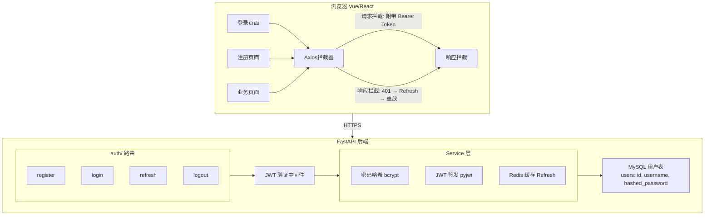

---

## 二、注册流程（时序图）

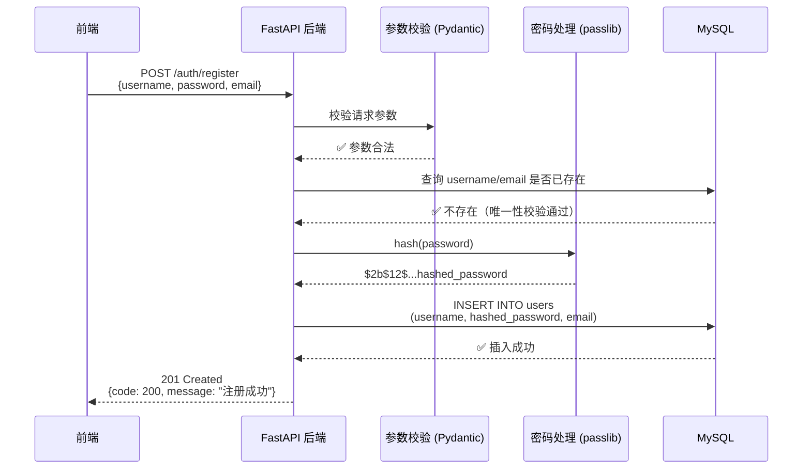

### 注册接口实现

```python
# app/schemas/auth.py
from pydantic import BaseModel, EmailStr, field_validator


class RegisterRequest(BaseModel):
    username: str
    password: str
    email: EmailStr

    @field_validator("username")
    @classmethod
    def validate_username(cls, v):
        if len(v) < 3 or len(v) > 20:
            raise ValueError("用户名长度需在 3-20 之间")
        return v

    @field_validator("password")
    @classmethod
    def validate_password(cls, v):
        if len(v) < 6:
            raise ValueError("密码长度不能少于 6 位")
        return v
```

```python
# app/routers/auth.py
from fastapi import APIRouter, Depends, HTTPException, status
from sqlalchemy.ext.asyncio import AsyncSession
from app import crud, schemas
from app.database import get_db

router = APIRouter(prefix="/auth", tags=["认证"])


@router.post("/register", status_code=status.HTTP_201_CREATED)
async def register(
    req: schemas.RegisterRequest,
    db: AsyncSession = Depends(get_db),
):
    # 1. 校验用户名是否已存在
    existing = await crud.get_user_by_username(db, req.username)
    if existing:
        raise HTTPException(
            status_code=status.HTTP_409_CONFLICT,
            detail="用户名已被注册",
        )

    # 2. 密码哈希
    hashed_pw = get_password_hash(req.password)

    # 3. 创建用户
    user = await crud.create_user(
        db,
        username=req.username,
        hashed_password=hashed_pw,
        email=req.email,
    )

    return success_response(message="注册成功")
```

---

## 三、登录流程（时序图）

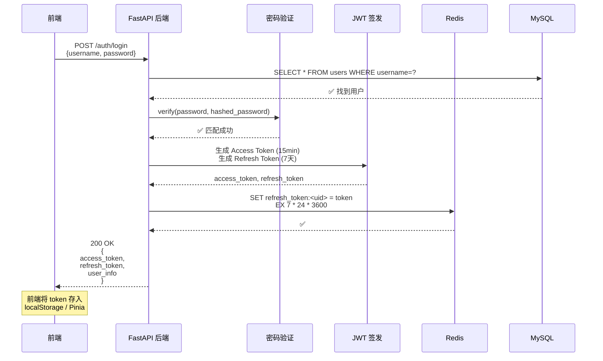

### 登录接口实现

```python
# app/routers/auth.py
from datetime import timedelta
from fastapi import APIRouter, Depends, HTTPException, status
from app import crud, schemas
from app.utils.jwt import create_access_token, create_refresh_token

router = APIRouter(prefix="/auth", tags=["认证"])


@router.post("/login")
async def login(
    req: schemas.LoginRequest,
    db: AsyncSession = Depends(get_db),
):
    # 1. 查找用户
    user = await crud.get_user_by_username(db, req.username)
    if not user:
        raise HTTPException(
            status_code=status.HTTP_401_UNAUTHORIZED,
            detail="用户名或密码错误",
        )

    # 2. 验证密码
    if not verify_password(req.password, user.hashed_password):
        raise HTTPException(
            status_code=status.HTTP_401_UNAUTHORIZED,
            detail="用户名或密码错误",
        )

    # 3. 签发双 Token
    access_token = create_access_token(
        data={"sub": str(user.id)},
        expires_delta=timedelta(minutes=15),
    )
    refresh_token = create_refresh_token(
        data={"sub": str(user.id)},
        expires_delta=timedelta(days=7),
    )

    return success_response(data={
        "access_token": access_token,
        "refresh_token": refresh_token,
        "token_type": "bearer",
        "user": {
            "id": user.id,
            "username": user.username,
            "email": user.email,
        },
    })
```

---

## 四、JWT Token 详解

### Token 结构

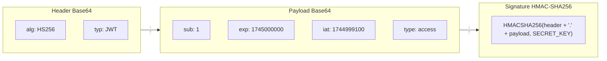

### 为什么需要双 Token（Access + Refresh）

如果只有一个 Access Token，有效期设短了用户频繁被踢下线，设长了泄露风险大。双 Token 方案解决这个矛盾：

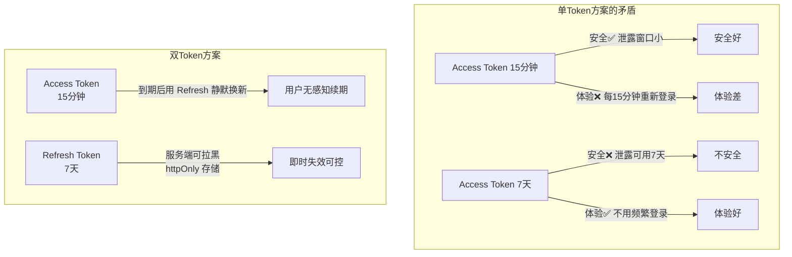

**一句话**：Access Token 管安全（短命），Refresh Token 管体验（长命但可控），两者配合实现**安全且无感**的认证。

### 双 Token 设计

| Token 类型          | 有效期   | 推荐存储                                   | 用途                |
| ----------------- | ----- | -------------------------------------- | ----------------- |
| **Access Token**  | 15 分钟 | 内存变量 / Pinia / localStorage            | 每次 API 请求携带，鉴权    |
| **Refresh Token** | 7 天   | **httpOnly Cookie** + 服务端 Redis       | 无感续期 Access Token |

#### 为什么 Access Token 不存 httpOnly Cookie

Access Token 每次请求都要携带，如果放在 httpOnly Cookie 里，前端 JS 无法读取，也就无法判断 token 是否过期、无法在 401 时自动刷新。所以 Access Token 必须放在 JS 可访问的地方（内存或 localStorage）。

#### 为什么 Refresh Token 建议存 httpOnly Cookie

| 存储位置 | XSS 攻击结果 | 原因 |
|---------|-------------|------|
| **localStorage** | ❌ Token 被窃取 | `<script>localStorage.getItem('refresh')</script>` 即可读取 |
| **httpOnly Cookie** | ✅ 安全 | 浏览器禁止 JS 读取 Cookie，攻击者脚本拿不到 |

代价是引入 CSRF 风险——Cookie 会自动随请求发送。解决：设置 `SameSite=Strict` + `CSRF Token`。

**权衡结论**：XSS 比 CSRF 更常见且危害更大，优先防 XSS，接受 CSRF 风险并通过 SameSite 缓解。

#### 为什么服务端还要存 Redis

| 目的               | 说明                                                       |
| ---------------- | -------------------------------------------------------- |
| **退出登录即时失效**     | 用户点"退出"时，把 Refresh Token 加入 Redis 黑名单，剩余有效期内的 token 立即作废 |
| **设备管理**         | 可以列出用户所有活跃的 Refresh Token，支持"踢掉其他设备"                     |
| **检测 Token 复用**  | 同一个 Refresh Token 被多次使用可能意味着被盗，可以拒绝并让用户重新登录              |
| **不依赖 JWT 自身过期** | JWT 一旦签发就不能撤回，Redis 黑名单弥补了"JWT 不可撤回"的缺陷                  |

#### 三种存储方案对比

| 方案 | Access 存哪 | Refresh 存哪 | XSS 防护 | CSRF 防护 | 实现复杂度 |
|------|-----------|------------|---------|---------|----------|
| A（最简） | localStorage | localStorage | ❌ 全量泄露 | ✅ 天然免疫 | 低 |
| B（推荐） | localStorage | **httpOnly Cookie** | ✅ Refresh 安全 | ⚠️ 需 SameSite | 中 |
| C（最安全） | **内存**（刷新丢失） | httpOnly Cookie | ✅ Access 也不落盘 | ⚠️ 需 SameSite | 高 |

**项目开发阶段推荐方案 B**：平衡安全与实现成本。

### SECRET_KEY 从哪来

SECRET_KEY 是 JWT 签名的**对称密钥**——签发 token 和验证 token 用的是同一个密钥。

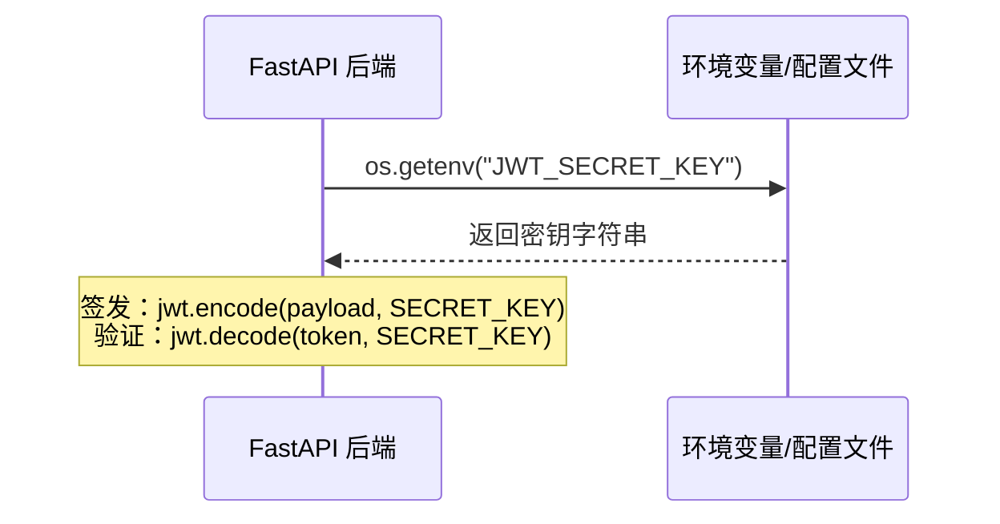

| 问题 | 回答 |
|------|------|
| **在哪设置** | 项目根目录 `.env` 文件或系统环境变量 |
| **怎么生成** | `openssl rand -hex 32` （64位十六进制字符串） |
| **放哪** | `.env` 文件，加入 `.gitignore`，**绝不提交到 Git** |
| **为什么不能硬编码** | 代码泄露 = 密钥泄露 = 黑客可以伪造任意用户的 token |
| **轮换怎么办** | 旧 token 还在有效期内，保留旧密钥验证；新签发的用新密钥 |

**.env 文件示例：**

```bash
# .env（已加入 .gitignore）
JWT_SECRET_KEY = 7f3b8c9a1d2e4f5a6b7c8d9e0f1a2b3c4d5e6f7a8b9c0d1e2f3a4b5c6d7e8f
```

### 签发 Token 工具函数

```python
# app/utils/jwt.py
import os
from datetime import datetime, timedelta, timezone
from jose import jwt

# ⚠️ 不要硬编码！生产环境从环境变量读取
# 生成方法：openssl rand -hex 32
SECRET_KEY = os.getenv("JWT_SECRET_KEY", "your-secret-key-must-be-very-long")
ALGORITHM = "HS256"
ACCESS_TOKEN_EXPIRE_MINUTES = 15
REFRESH_TOKEN_EXPIRE_DAYS = 7


def create_access_token(data: dict, expires_delta: timedelta | None = None):
    to_encode = data.copy()
    now = datetime.now(timezone.utc)
    expire = now + (expires_delta or timedelta(minutes=ACCESS_TOKEN_EXPIRE_MINUTES))

    to_encode.update({
        "exp": expire,
        "iat": now,
        "type": "access",
    })
    return jwt.encode(to_encode, SECRET_KEY, algorithm=ALGORITHM)


def create_refresh_token(data: dict, expires_delta: timedelta | None = None):
    to_encode = data.copy()
    now = datetime.now(timezone.utc)
    expire = now + (expires_delta or timedelta(days=REFRESH_TOKEN_EXPIRE_DAYS))

    to_encode.update({
        "exp": expire,
        "iat": now,
        "type": "refresh",
    })
    return jwt.encode(to_encode, SECRET_KEY, algorithm=ALGORITHM)
```

### 过期时间存在哪？怎么验证的？

签发时把过期时间写进 Payload：

```python
payload = {
    "sub": "1",
    "exp": 1745000000,    # ← Unix 时间戳，写在 JWT 的 Payload 里
    "iat": 1744999100,
    "type": "access",
}
```

验证时 `jwt.decode()` 自动检查：

```python
try:
    payload = jwt.decode(token, SECRET_KEY, algorithms=[ALGORITHM])
    # ↑ 这行自动做两件事：
    # 1. 验证签名（防篡改）
    # 2. 检查 exp > now()（是否过期）
    # 过期就抛 ExpiredSignatureError
except jwt.ExpiredSignatureError:
    raise HTTPException(status_code=401, detail="Token 已过期")
```

**关键**：exp 被**签名保护**，攻击者不能改大 exp 来延长有效期（改了签名就不匹配）。所以后端**不需要查数据库**就知道 token 过没过期。

---

## 五、Token 刷新流程

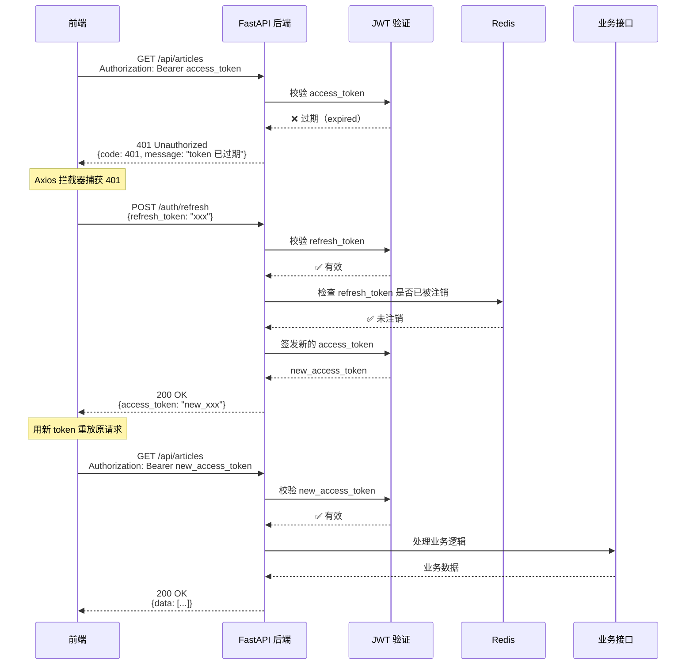

### Refresh 接口实现

```python
# app/routers/auth.py
from pydantic import BaseModel


class RefreshRequest(BaseModel):
    refresh_token: str


@router.post("/refresh")
async def refresh_token(
    req: RefreshRequest,
    db: AsyncSession = Depends(get_db),
):
    try:
        payload = jwt.decode(
            req.refresh_token,
            SECRET_KEY,
            algorithms=[ALGORITHM],
        )
    except jwt.ExpiredSignatureError:
        raise HTTPException(status_code=401, detail="Refresh token 已过期，请重新登录")
    except jwt.JWTError:
        raise HTTPException(status_code=401, detail="无效的 Refresh token")

    # 校验 token 类型
    if payload.get("type") != "refresh":
        raise HTTPException(status_code=401, detail="无效的 Token 类型")

    # 可选：检查 Redis 黑名单
    # if await redis.get(f"blacklist:{req.refresh_token}"):
    #     raise HTTPException(status_code=401, detail="Token 已被注销")

    user_id = payload.get("sub")

    # 签发新的 Access Token
    new_access_token = create_access_token(
        data={"sub": user_id},
        expires_delta=timedelta(minutes=15),
    )

    return success_response(data={
        "access_token": new_access_token,
        "token_type": "bearer",
    })
```

---

## 六、JWT 认证中间件（依赖注入）

```python
# app/dependencies/auth.py
from fastapi import Depends, HTTPException, status
from fastapi.security import HTTPBearer, HTTPAuthorizationCredentials
from jose import jwt, JWTError
from app.utils.jwt import SECRET_KEY, ALGORITHM

# FastAPI 内置的 Bearer token 提取器
security = HTTPBearer()


async def get_current_user(
    credentials: HTTPAuthorizationCredentials = Depends(security),
) -> int:
    """从 JWT 中提取当前登录用户 ID"""
    token = credentials.credentials

    try:
        payload = jwt.decode(token, SECRET_KEY, algorithms=[ALGORITHM])
    except jwt.ExpiredSignatureError:
        raise HTTPException(
            status_code=status.HTTP_401_UNAUTHORIZED,
            detail="Token 已过期",
        )
    except JWTError:
        raise HTTPException(
            status_code=status.HTTP_401_UNAUTHORIZED,
            detail="无效的 Token",
        )

    # 校验 token 类型
    if payload.get("type") != "access":
        raise HTTPException(
            status_code=status.HTTP_401_UNAUTHORIZED,
            detail="无效的 Token 类型",
        )

    user_id = payload.get("sub")
    if user_id is None:
        raise HTTPException(
            status_code=status.HTTP_401_UNAUTHORIZED,
            detail="Token 中缺少用户信息",
        )

    return int(user_id)
```

### 在业务接口中使用

```python
# app/routers/articles.py
from fastapi import APIRouter, Depends
from app.dependencies.auth import get_current_user

router = APIRouter(prefix="/articles", tags=["文章"])


@router.get("/")
async def list_articles(user_id: int = Depends(get_current_user)):
    """只有登录用户才能访问"""
    return success_response(data=[...])
```

---

## 七、Access Token 验证原理（核心关键）

> 🤔 **关键问题**：后端把 access_token 发给了前端，后续请求前端把 token 带回来，后端怎么知道这个 token 是真的？要不要查数据库？

### 一句话回答

**不需要查数据库。** JWT 是"自包含"的——后端用 **同一个密钥** 重新计算签名，比对签名是否一致，就能判断 token 是否真实有效。

### 详细流程拆解

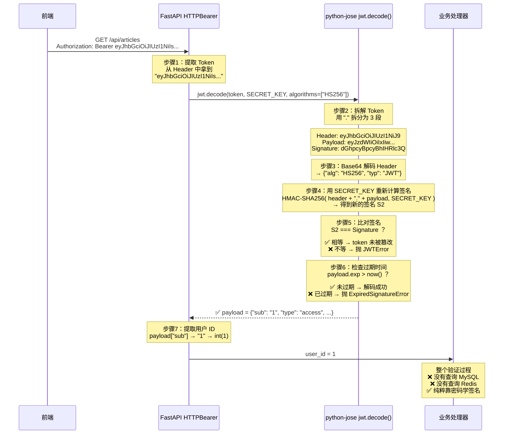

### 签名验证原理图

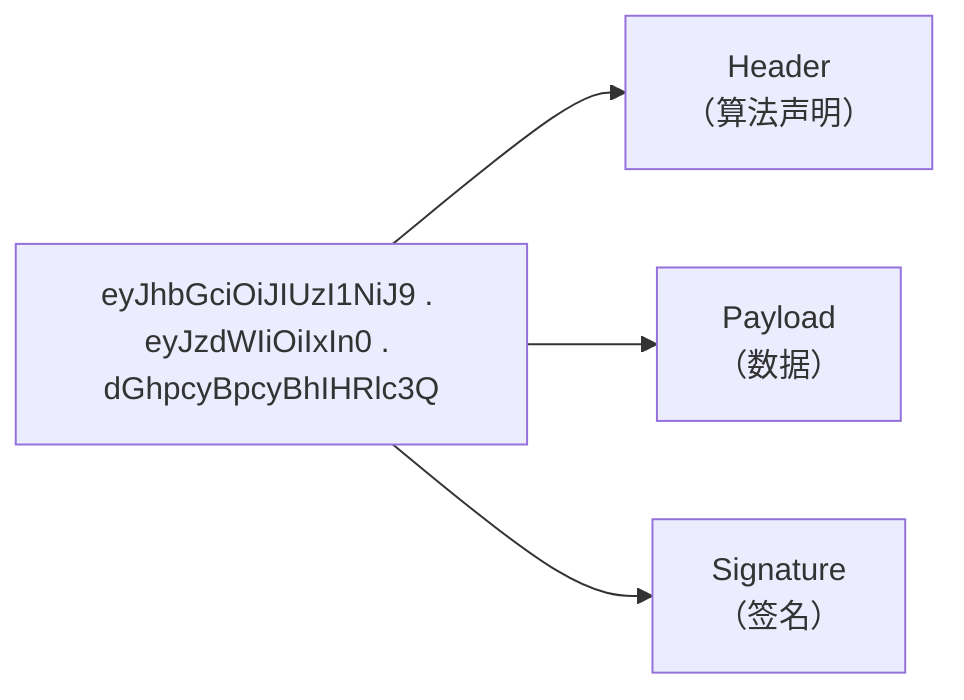

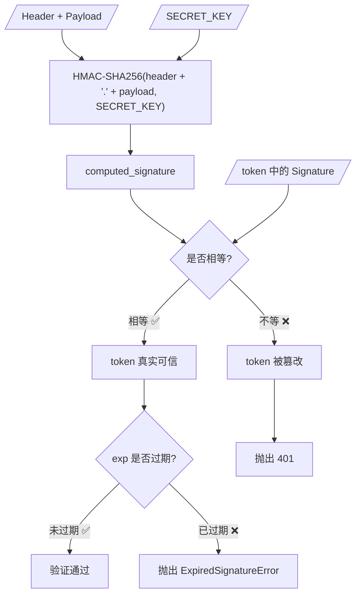

### 一句话总结：为什么不需要查数据库？

| 认证方式 | 验证方法 | 是否查库 |
|---------|---------|---------|
| **Session 认证** | 拿着 session_id 去 Redis/DB 查对应用户 | ✅ 每次请求都查 |
| **JWT 认证** | 用密钥本地验证签名，签名=真、签名≠假 | ❌ 完全不查 |

**JWT 的核心思想**：数据（user_id）直接编码在 token 里，后端用签名保证这个数据没有被篡改过，因此**不需要任何集中式存储**即可完成身份认证。

### 但如果想知道用户的更多信息（如用户名、头像）呢？

```python
# ❌ 错误做法：在 JWT payload 里塞一大堆东西
payload = {
    "sub": "1",
    "username": "admin",   # 不好 — 用户改名后 token 里还是旧的
    "avatar": "xxx.jpg",   # 不好 — token 没法实时更新
    "role": "admin",
}

# ✅ 正确做法：payload 只存 user_id，需要更多信息时查库
payload = {
    "sub": "1",            # 唯一标识
    "type": "access",
    "exp": 1745000000,
    "iat": 1744999100,
}

# 在处理器中按需查库
@router.get("/me")
async def get_my_profile(
    user_id: int = Depends(get_current_user),
    db: AsyncSession = Depends(get_db),
):
    user = await crud.get_user_by_id(db, user_id)  # 这里才查库
    return success_response(data=user)
```

---

## 九、前端 Axios 拦截器

```javascript
// src/utils/http.js
import axios from 'axios'

const http = axios.create({ baseURL: '/api' })

// ---- 是否正在刷新 Token ----
let isRefreshing = false
let pendingQueue = []

function addPending(config) {
  return new Promise((resolve) => {
    pendingQueue.push({ config, resolve })
  })
}

function flushPending(newToken) {
  pendingQueue.forEach(({ config, resolve }) => {
    config.headers.Authorization = `Bearer ${newToken}`
    resolve(http(config))  // 用新 token 重放请求
  })
  pendingQueue = []
}

// ── 请求拦截器：自动带 Token ──
http.interceptors.request.use((config) => {
  const token = localStorage.getItem('access_token')
  if (token) {
    config.headers.Authorization = `Bearer ${token}`
  }
  return config
})

// ── 响应拦截器：401 时静默刷新 ──
http.interceptors.response.use(
  (response) => response,              // 正常响应直接过
  async (error) => {
    const { config, response } = error
    if (response?.status !== 401) {
      return Promise.reject(error)     // 非 401 直接抛
    }

    // 防止死循环：如果刷新接口本身 401，直接跳登录
    if (config.url === '/auth/refresh') {
      localStorage.clear()
      window.location.href = '/login'
      return Promise.reject(error)
    }

    // 如果正在刷新，排队等待
    if (isRefreshing) {
      const res = await addPending(config)
      return res
    }

    isRefreshing = true

    try {
      const refreshToken = localStorage.getItem('refresh_token')
      const { data } = await axios.post('/auth/refresh', { refresh_token: refreshToken })

      const newToken = data.data.access_token
      localStorage.setItem('access_token', newToken)

      // 重放排队中的请求
      flushPending(newToken)

      // 重放当前请求
      config.headers.Authorization = `Bearer ${newToken}`
      return http(config)
    } catch {
      localStorage.clear()
      window.location.href = '/login'
      return Promise.reject(error)
    } finally {
      isRefreshing = false
    }
  },
)

export default http
```

---

## 十、安全最佳实践

- [ ] **HTTPS 传输** → 生产环境强制 HTTPS，杜绝中间人攻击
- [ ] **密码哈希** → bcrypt / Argon2，绝不存明文
- [ ] **JWT Secret** → 足够长、随机、环境变量注入
- [ ] **Token 有效期** → Access 短（15min）+ Refresh 长（7d）
- [ ] **前端存储** → Access 放内存/ls，Refresh 放 httpOnly Cookie（防 XSS 窃取）
- [ ] **退出登录** → 前端清 token，后端 Redis 拉黑 Refresh Token
- [ ] **密码强度** → 最少 6 位，建议含字母+数字+符号
- [ ] **登录限流** → 同 IP/同用户 5 次错误 → 锁定 15min
- [ ] **CORS** → FastAPI 配置 CORSMiddleware，只允许前端域名
- [ ] **XSS 防护** → 不要在前端存敏感信息，输出编码
- [ ] **CSRF 防护** → Token 放在 Header 而非 Cookie（Bearer 模式天然免疫 CSRF）

---

## 十一、退出登录

```python
@router.post("/logout")
async def logout(
    req: RefreshRequest,
    user_id: int = Depends(get_current_user),
):
    # 将 Refresh Token 加入 Redis 黑名单，使其立即失效
    await redis.setex(
        f"blacklist:{req.refresh_token}",
        7 * 24 * 3600,  # 与 refresh_token 有效期一致
        "revoked",
    )
    return success_response(message="已退出登录")
```

```javascript
// 前端
async function logout() {
  await http.post('/auth/logout', {
    refresh_token: localStorage.getItem('refresh_token'),
  })
  localStorage.clear()
  router.push('/login')
}
```

---

## 十二、完整数据流总结

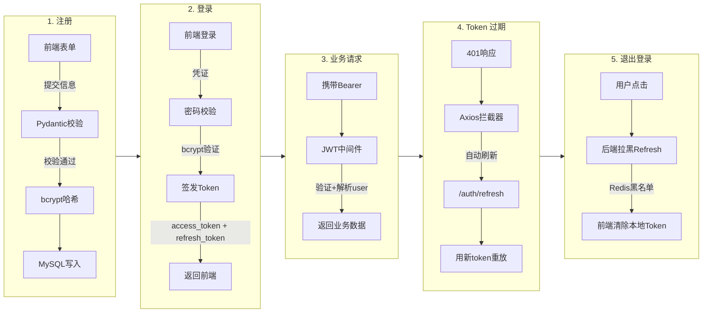

---

## 依赖清单

```bash
# requirements.txt
fastapi
uvicorn[standard]
sqlalchemy[asyncio]
aiomysql
passlib[bcrypt]
python-jose[cryptography]   # JWT 签发与验证
python-multipart            # OAuth2 表单登录
pydantic[email]             # Email 校验
redis                       # Refresh Token 黑名单 / 限流
```
